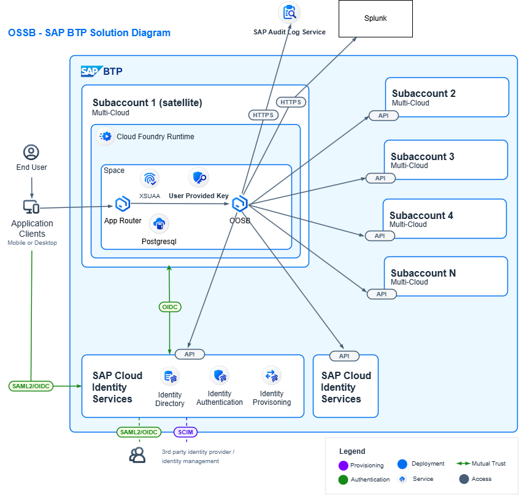

# OOBS

[](LICENSE)

Open-source containment service for SAP BTP. Locks compromised users (IAS deactivate + shadow-user delete + role-collection strip), with an unlock path, basic SoD detection, a "Fiori"/SAPUI5 admin UI, and a REST API for SOAR tools.

## Stack

- Java 21 (compile target, auto-provisioned via the Gradle toolchain)
- Spring Boot 3.4.1 (web, security, jdbc, jOOQ, actuator, validation, oauth2-resource-server)
- Gradle (Groovy DSL) + `nu.studer.jooq` 9.0 codegen plugin + Flyway Gradle plugin 10.20.1
- jOOQ 3.19.15 type-safe SQL DSL
- Flyway + Postgres 16
- `io.pivotal.cfenv:java-cfenv-boot` 3.1.5 for `VCAP_SERVICES` datasource binding in the `cloud` profile
- Testcontainers for tests
- SAPUI5 frontend (CDN-hosted in dev)
- standalone unmanaged `@sap/approuter` for the CF deployment frontend / routing / auth
- xsuaa for roles (-> will be migrated to AMS later)

## Run locally

Requires: Docker Desktop running, any JDK >= 17 on `PATH` for the Gradle daemon. Gradle auto-provisions JDK 21 for compilation.

```powershell
docker compose up -d           # postgres on :5432
./gradlew bootRun              # local profile is hardcoded into bootRun
# local UI: http://localhost:8080/ui/
```

## Tests

```powershell
./gradlew test
```

Testcontainers spins up an ephemeral Postgres per test class. 52 tests today. 

## Schema changes (Flyway + jOOQ codegen)

All repos use jOOQ's typed DSL against generated `Tables`/`Records` classes
in `src/main/generated/jooq/`. The generated sources **are committed** to
git so a fresh checkout (or the CF buildpack) can `./gradlew bootJar`
without a live DB.

After every change to `src/main/resources/db/migration/V*.sql` you must
regenerate the typed classes:

```powershell
docker compose up -d                   # if not already running
./gradlew generateJooq  
git add src/main/generated/jooq  
```

`generateJooq` runs Flyway against the local dev DB to bring it to HEAD,
then jOOQ introspects the resulting schema and writes typed Java sources
to `src/main/generated/jooq/`. DB coordinates come from `gradle.properties`
(local dev defaults pointing at the docker-compose service)

```powershell
$env:ORG_GRADLE_PROJECT_jooqDbUrl      = "jdbc:postgresql://my-host:5432/btpc"
$env:ORG_GRADLE_PROJECT_jooqDbUser     = "..."
$env:ORG_GRADLE_PROJECT_jooqDbPassword = "..."
./gradlew generateJooq
```

If you forget to regenerate after a schema change, the Java compile breaks
on the next column / table reference!

## Profiles

| profile | when                     | datasource                       | auth                                  |
|---------|--------------------------|----------------------------------|---------------------------------------|
| `local` | local laptop             | localhost:5432/btpc              | dev-auth (X-Test-User/Scopes headers) |
| `test`  | `./gradlew test`         | Testcontainers (random port)     | dev-auth                              |
| `cloud` | BTP Cloud Foundry deploy | user provided service instance   | XSUAA JWT (resource-server)           |

## Deploy to BTP Cloud Foundry

One-time setup in the target subaccount:

```bash
cf login -a https://api.cf.<region>.hana.ondemand.com # --sso
cf target -o <org> -s <space>

# general: keep in mind to assign the service entitlements first
# 1. XSUAA instance, fed from xs-security.json (defines scopes + role templates)
cf create-service xsuaa application btp-containment-xsuaa -c xs-security.json

# 2. Postgres - edit to either trial or another plan depending on your setup
cf create-service postgresql-db trial/standard btp-containment-postgres

# 3. User-provided service holding the master key for AES-GCM at-rest encryption
#    The credential is a 32-byte AES-256 key, base64-encoded.
$bytes = New-Object 'Byte[]' 32
[System.Security.Cryptography.RandomNumberGenerator]::Create().GetBytes($bytes)
$key = [Convert]::ToBase64String($bytes)
echo $key   # optionally save this key -> you need it to migrate the program to another subaccount

$tmp = Join-Path $env:TEMP 'btp-containment-crypto-key.json'
@{ master_key = $key } | ConvertTo-Json | Set-Content -Path $tmp -Encoding ascii
cf create-user-provided-service btp-containment-crypto-key -p $tmp
Remove-Item $tmp -Force   # don't leave the key on disk
```

Additionally you need to adjust the xs-security.json, xs-app.json, manifest.yml and application properties to enter your URLs (also if you use custom domains).

Build + push:

```powershell
./gradlew bootJar   # also runs prepareApprouter -> copies src/main/resources/static into approuter/resources (profile cloid)
cd approuter && npm install && cd ..
cf push # you need to adjust the xs-security.json oauth redirect url to match your url -> no wildcards see comments above..
```

`bootJar` does **not** need Postgres - the generated jOOQ sources are
already committed under `src/main/generated/jooq/`, so a fresh clone
compiles without a live DB.

That deploys two apps (srv + approuter) and binds the three services above. The approuter URL is the user-facing endpoint; the srv app requires auth.

The SAPUI5 SPA is served **by the approuter** in cloud (xs-app.json's `localDir`) and **by Spring** in the local/test profiles (classpath static handler). The bytes live in `src/main/resources/static/` either way; the Gradle `prepareApprouter` task mirrors them into `approuter/resources/` before `cf push` so the Node app ships its own copy.

After deploy, assign yourself the "BTP Containment Administrator" role collection in the cockpit, log in via the approuter, and the SAPUI5 UI loads with a real XSUAA token.

## Architecture (one page)



## TODO

- Locking of Global Account Users (although covered if trusted Cloud Identity Service for platform user)
- Locking on-premises users via the cloud connector
- Revoking Client Creds of SK -> only in combination with IR use-case

## License

Licensed under the [GNU Affero General Public License, Version 3.0](LICENSE)
(`AGPL-3.0-only`). In short: you are free to use, run, and self-host this
software, but if you modify it and make it available to others over a network,
you must release your modified source under the same license.

Contributions are welcome (see [CONTRIBUTING.md](CONTRIBUTING.md)).

Copyright © 2026 Jan-Luca Gruber.